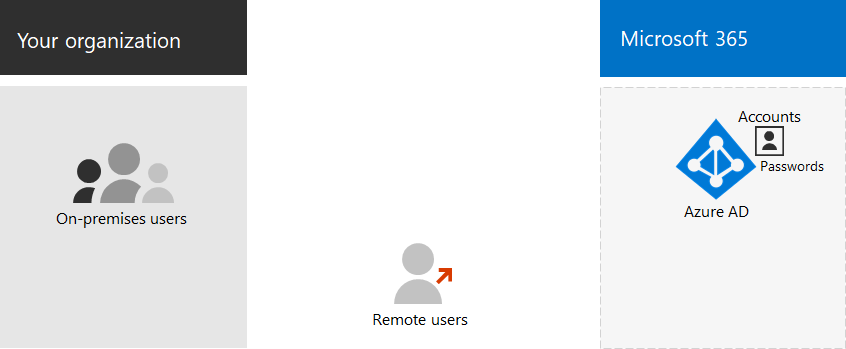

# 僅限 Microsoft 365 雲端身分識別Microsoft 365 cloud-only identity

*本文適用于 Microsoft 365 Enterprise 和 Office 365 企業版。**This article applies to both Microsoft 365 Enterprise and Office 365 Enterprise.*

使用僅限雲端的身分識別，所有的使用者、群組和連絡人都儲存在 Microsoft 365 訂閱的 Azure Active Directory （Azure AD）租使用者中。With cloud-only identity, all your users, groups, and contacts are stored in the Azure Active Directory (Azure AD) tenant of your Microsoft 365 subscription. 以下是僅限雲端身分識別的基本元件。Here are the basic components of cloud-only identity.
 

組織中的使用者和他們的使用者帳戶可以多種方式分類。Users and their user accounts in organizations can be categorized in a number of ways. 例如，有些員工是員工，且具有永久狀態。For example, some are employees and have a permanent status. 有些是具有暫存檔狀態的廠商、合同工或合作夥伴。Some are vendors, contractors, or partners that have a temporary status. 有些外部使用者沒有使用者帳戶，但仍然必須授與特定服務和資源的存取權，以支援互動和協同作業。Some are external users that have no user accounts but must still be granted access to specific services and resources to support interaction and collaboration. 例如：For example:

- 租用戶帳戶代表您為雲端服務授權之組織內的使用者Tenant accounts represent users within your organization that you license for cloud services

- 企業對企業 (B2B) 帳戶代表不屬於您邀請參與共同作業之組織的使用者Business to Business (B2B) accounts represent users outside your organization that you invite to participate in collaboration

在您的組織中製作使用者類型的股份。Take stock of the types of users in your organization. 分組的群組為何？What are the groupings? 例如，您可以將高層次的功能或目的群組的使用者群組為您的組織。For example, you can group users by high-level function or purpose to your organization.

此外，某些雲端服務可以與組織外的使用者共用，而不需使用任何使用者帳戶。您也必須識別使用者的這些群組。Additionally, some cloud services can be shared with users outside your organization without any user accounts. You'll need to identify these groups of users as well.

您可以針對多種目的使用 Azure AD 中的群組，以簡化雲端環境的管理。You can use groups in Azure AD for several purposes that simplify management of your cloud environment. 例如，使用 Azure AD 群組時，您可以：For example, with Azure AD groups, you can:

- 使用以群組為基礎的授權，可在新增為成員時，自動將 Microsoft 365 的授權指派給您的使用者帳戶。Use group-based licensing to assign licenses for Microsoft 365 to your user accounts automatically as soon as they are added as members.
- 根據使用者帳戶屬性（例如部門名稱），以動態方式將使用者帳戶新增至特定群組。Add user accounts to specific groups dynamically based on user account attributes, such as department name.
- 自動布建使用者的軟體（SaaS）應用程式，並使用多重要素驗證（MFA）和其他條件式存取規則來保護對這些應用程式的存取。Automatically provision users for Software as a Service (SaaS) applications and to protect access to those applications with multi-factor authentication (MFA) and other Conditional Access rules.
- 為 SharePoint Online 小組網站提供許可權和存取層級。Provision permissions and levels of access for SharePoint Online team sites.

您可以使用下列方式建立新的***使用者***：You create new ***users*** with:

- [Microsoft 365 系統管理中心The Microsoft 365 admin center](https://docs.microsoft.com/office365/admin/add-users/add-users)
- [Microsoft 365 的 PowerShellPowerShell for Microsoft 365](https://docs.microsoft.com/office365/enterprise/powershell/create-user-accounts-with-office-365-powershell)

您可以使用下列方式建立新的***群組***：You create new ***groups*** with:

- [Microsoft 365 系統管理中心The Microsoft 365 admin center](https://docs.microsoft.com/office365/admin/create-groups/create-groups)
- [Microsoft 365 的 PowerShellPowerShell for Microsoft 365](https://docs.microsoft.com/office365/enterprise/powershell/manage-office-365-groups-with-powershell)

## 僅限雲端身分識別的下一個步驟Next step for cloud-only identity

[將授權指派給使用者帳戶Assign licenses to user accounts](assign-licenses-to-user-accounts.md)
