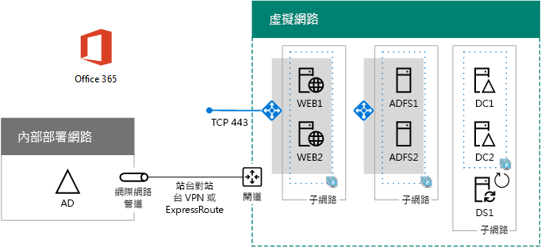

# 高可用性同盟驗證階段 5：設定 Office 365 的同盟驗證

 **摘要：** 在 Microsoft Azure 中設定 Office 365 高可用性同盟驗證的 Azure AD Connect。
 
在此部署高可用性同盟的驗證 Office 365 的 Azure 基礎結構服務中的最後一個階段中，您取得並安裝公用憑證授權單位所發出的憑證，確認您的組態，然後安裝和執行 Azure AD連線的目錄同步處理伺服器上。 Azure AD Connect 設定您的 Office 365 訂閱和您的 Active Directory Federation Services (AD FS) 和同盟驗證的 web 應用程式 proxy 伺服器。
  
所有階段，請參閱[在 Azure 中的 Office 365 部署高可用性同盟的驗證](deploy-high-availability-federated-authentication-for-office-365-in-azure.md)。
  
## 取得公用憑證，並將它複製到目錄同步處理伺服器

從具有下列內容的公用憑證授權單位取得數位憑證：
  
- 適用於建立 SSL 連線的 X.509 憑證。
    
- 主體替代名稱 (SAN) 擴充屬性設為同盟服務 FQDN (範例： fs.contoso.com)。
    
- 憑證必須有私密金鑰，並以 PFX 格式儲存。
    
此外，您的組織電腦和裝置必須信任公用憑證授權單位發出的數位憑證。 此信任會建立具有安裝在電腦和裝置上受信任的根憑證授權單位存放區中的公用憑證授權單位根憑證。 通常在執行 Microsoft Windows 的電腦有一組的這種常用的憑證授權單位所安裝的憑證。 如果尚未安裝來自您的公用憑證授權單位的根憑證，您必須部署此電腦和組織的裝置。
  
如需同盟驗證的憑證需求的詳細資訊，請參閱[同盟安裝和組態必要條件](https://docs.microsoft.com/azure/active-directory/connect/active-directory-aadconnect-prerequisites#prerequisites-for-federation-installation-and-configuration)。
  
當您收到憑證時，請將它複製到目錄同步處理伺服器的 c： 磁碟機上的資料夾。 例如，SSL.pfx 的檔案名稱，並將它儲存在 c:\\目錄同步處理伺服器上的 [憑證] 資料夾。
  
## 確認您的設定

您現在應該可以設定 Azure AD Connect 與 Office 365 同盟的驗證。 若要確保您，以下是一份檢查清單：
  
- 貴組織的公用網域會新增至您的 Office 365 訂閱。
    
- 貴組織的 Office 365 使用者帳戶設定為貴組織的公用網域名稱，且可以成功登入。
    
- 您已決定同盟服務 FQDN 基礎公用網域名稱。
    
- 公用 DNS A 記錄您同盟服務 FQDN 指向公用 IP 位址的網際網路對向 Azure 負載平衡器的 web 應用程式 proxy 伺服器。
    
- 私人 DNS A 記錄您同盟服務 FQDN 指向私人 IP 位址的 AD FS 伺服器內部 Azure 負載平衡器。
    
- 公用憑證授權單位 isssued 數位憑證適用於 SSL 連線與 SAN (英文） 設定為同盟服務 FQDN 是 PFX 檔案儲存在您的目錄同步處理伺服器上。
    
- 在受信任的根憑證授權單位安裝公用憑證授權單位根憑證儲存在電腦和裝置上。
    
以下是在 Contoso 組織的範例：
  
**高可用性的範例設定同盟驗證基礎結構，在 Azure 中**

  
## 執行 Azure AD Connect，若要設定的同盟的驗證

Azure AD Connect 工具設定 AD FS 伺服器、 web 應用程式 proxy 伺服器，以及 Office 365 同盟驗證，使用下列步驟：
  
1. 使用具備本機系統管理員權限的網域帳戶建立您的目錄同步處理伺服器的遠端桌面連線。
    
2. 從目錄同步處理伺服器的桌面，開啟 Internet Explorer 並移至[https://aka.ms/aadconnect](https://aka.ms/aadconnect)。
    
3. 在**Microsoft Azure Active Directory Connect** ] 頁面上，按一下 [**下載**]，然後按一下 [**執行**。
    
4. 在 [**歡迎使用 Azure AD Connect** ] 頁面上，按一下 [**我同意**]，然後按一下**繼續。**
    
5. 在 [**快速設定**] 頁面上，按一下 [**自訂**]。
    
6. 在 [**安裝所需的元件**] 頁面上，按一下 [**安裝**]。
    
7. 在 [使用者登入]**** 頁面上，按一下 [和 AD FS 的同盟]****，然後按 [下一步]****。
    
8. 在 [**連線到 Azure AD** ] 頁面上輸入的名稱與您的 Office 365 訂閱的全域系統管理員帳戶的密碼，然後按一下 [**下一步**。
    
9. 在 [**連線您的目錄**] 頁面上，確定 [**樹系**中已選取 [您的內部部署 Active Directory 網域服務 (AD DS) 樹系、 輸入的名稱和網域系統管理員帳戶的密碼、 按一下 [**新增目錄**，然後選取按一下 [**下一步**]。
    
10. 在**Azure AD 登入設定**] 頁面上，按一下 [**下一步**]。
    
11. 在 [**網域及 OU 篩選**] 頁面上，按一下 [**下一步**]。
    
12. 在**用來唯一識別您的使用者**] 頁面上，按一下 [**下一步**]。
    
13. 在 [**篩選使用者和裝置**] 頁面上，按一下 [**下一步**]。
    
14. 在 [**選擇性功能**] 頁面上，按一下 [**下一步**]。
    
15. 在 [ **AD FS 伺服器陣列**] 頁面上，按一下 [**設定新的 AD FS 伺服器陣列**。
    
16. 按一下 [**瀏覽]** 並指定的公用憑證授權單位的 SSL 憑證的名稱與位置。
    
17. 出現提示時，輸入憑證的密碼，然後按一下 [**確定]**。
    
18. 確認**同盟服務名稱**與**主體名稱**設定為同盟服務 FQDN，然後按 [**下一步**。
    
19. 在**AD FS 伺服器**] 頁面上，輸入您第一部 AD FS 伺服器的名稱 （資料表 M-項目 4-虛擬機器名稱欄），然後按一下 [**新增]**。
    
20. 輸入第二個 AD FS 伺服器的名稱 （資料表 M-項目 5-虛擬機器名稱欄），按一下 [**新增**]，然後按一下 [**下一步**。
    
21. 在**Web 應用程式 Proxy 伺服器**] 頁面中，輸入第一個 web 應用程式 proxy 伺服器的名稱 （資料表 M-項目 6-虛擬機器名稱欄），然後按一下 [**新增]**。
    
22. 輸入第二個 web 應用程式 proxy 伺服器的名稱 （資料表 M-項目 7-虛擬機器名稱欄），按一下 [**新增**]，然後按一下 [**下一步**。
    
23. 在**網域系統管理員認證**] 頁面上，輸入使用者名稱和密碼的網域管理員帳戶，然後再按 [**下一步**。
    
24. 在**AD FS 服務帳戶**] 頁面上，輸入使用者名稱和企業系統管理員帳戶密碼，然後再按 [**下一步**。
    
25. 在**Azure AD 網域**] 頁面的 [**網域**] 中，選取您組織的 DNS 網域名稱，，然後按一下 [**下一步**。
    
26. 在 [準備設定]**** 頁面上，按一下 [安裝]****。
    
27. 在 [安裝完成]**** 頁面上，按一下 [驗證]****。 您應該在內部網路和網際網路看到兩個訊息，表示已順利驗證組態。
    
  - 內部網路郵件應列出您的 Azure 內部負載平衡器的 AD FS 伺服器的私人 IP 位址。
    
  - 網際網路郵件應列出您 web 應用程式 proxy 伺服器您 Azure 網際網路對應負載平衡器的公用 IP 位址。
    
28. 在 [安裝完成]**** 頁面上，按一下 [結束]****。
    
以下是具有預留位置名稱伺服器的最終組態。
  
**階段 5： 的最終組態的高可用性同盟驗證基礎結構，在 Azure 中**

  
完成您的高可用性同盟的驗證基礎結構的 Azure 中 Office 365。
  
## 另請參閱

[Azure 中的 Office 365 高可用性同盟驗證](deploy-high-availability-federated-authentication-for-office-365-in-azure.md)
  
[Office 365 開發人員/測試環境的同盟身分識別](federated-identity-for-your-office-365-dev-test-environment.md)
  
[雲端採用和混合式解決方案](cloud-adoption-and-hybrid-solutions.md)

[Office 365 的同盟身分識別](https://support.office.com/article/Understanding-Office-365-identity-and-Azure-Active-Directory-06a189e7-5ec6-4af2-94bf-a22ea225a7a9#bk_federated)

