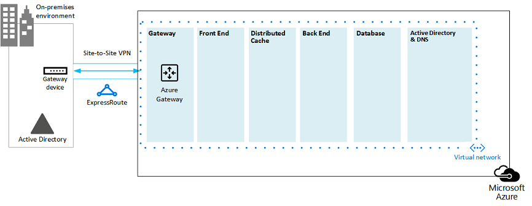

# Microsoft Azure SharePoint 2013 架構

Azure 是一種主控 SharePoint Server 2013 解決方案的良好環境。 在大多數情況下，建議使用 Microsoft 365，但是在 Azure 主控的 SharePoint 伺服器陣列可以是特定解決方案的一個不錯選項。 本文說明如何設計 SharePoint 方案，使其符合 Azure 平臺的完美程度。 下列兩個特定解決方案用作範例：
  
- [Microsoft Azure 中的 SharePoint Server 2013 災害復原](sharepoint-server-2013-disaster-recovery-in-microsoft-azure.md)
    
- [Microsoft Azure 中使用 SharePoint Server 2013 的網際網路網站](internet-sites-in-microsoft-azure-using-sharepoint-server-2013.md)
    
## Azure 基礎結構服務的建議 SharePoint 解決方案

Azure 基礎結構服務是主控 SharePoint 解決方案的極具說服力的選項。 有些方案比其他解決方案更適合使用此平臺。 下表顯示建議的解決方案。
  
|**解決方案**|**為何建議使用此解決方案進行 Azure**|
|:-----|:-----|
|開發和測試環境    |這很容易建立及管理這些環境。    |
|內部部署 SharePoint 伺服器陣列至 Azure 的災難修復    |**主控次要資料中心**使用 Azure，而不是在不同地區的次要資料中心中投資。   **低成本的災害復原環境**維護和支付的資源少於內部部署的嚴重損壞修復環境。 資源數目取決於您所選擇的嚴重損壞復原環境：冷待命、溫待命或熱待機。   **更多彈性平臺**萬一發生嚴重損壞，請輕鬆向外延展您的修復 SharePoint 伺服器陣列，以滿足負載需求。 當您不再需要資源時放大。   請參閱[在 Microsoft Azure 中 SharePoint Server 2013 災難修復](sharepoint-server-2013-disaster-recovery-in-microsoft-azure.md)。    |
|使用 Microsoft 365 無法使用之功能和縮放功能的網際網路對向網站    |**致力於您的努力**專注于建立卓越的網站，而不是建立基礎結構。   **在 Azure 中利用彈性**新增新的伺服器，並只支付您需要的資源，以調整需求的伺服器陣列大小。 不支援動態電腦分攤（自動縮放）。   **使用 Azure Active Directory （AD）** 請利用 Azure AD 取得客戶帳戶。   **新增 Microsoft 365 中無法使用的 SharePoint 功能**新增深入報告和 web analytics。   請參閱[使用 SharePoint Server 2013 的 Microsoft Azure 中的網際網路網站](internet-sites-in-microsoft-azure-using-sharepoint-server-2013.md)。    |
|支援 Microsoft 365 或內部部署環境的應用程式伺服器陣列    |在 Azure 中**建立、測試和主控應用程式**，以同時支援內部部署和雲端環境。   在 Azure 中**主控此角色**，而不是購買內部部署環境的新硬體。   |
   
針對內部網路和共同作業解決方案及工作量，請考慮下列選項：
  
- 判斷 Microsoft 365 是否符合您的業務需求，或是否可以成為解決方案的一部分。 Microsoft 365 提供一個功能齊全的功能集，永遠都是最新的。
    
- 如果 Microsoft 365 不符合您的所有業務需求，請考慮從 Microsoft 諮詢服務（MCS）內部部署 SharePoint 2013 的標準實施。 標準架構可以是比自訂更快速、成本低且更容易的解決方案。 
    
- 如果標準執行不符合您的業務需求，請考慮使用自訂的內部部署解決方案。
    
- 如果使用雲端平臺對您的業務需求很重要，請考慮使用 Azure 基礎結構服務中所主控的 SharePoint 2013 標準或自訂的實施。 與其他非原生 Microsoft public 雲端平臺相比，在 Azure 中支援的 SharePoint 解決方案更輕鬆。
    
## 設計 Azure 環境之前

雖然本文使用 SharePoint 拓朴的範例，但您可以將這些設計概念與任何 SharePoint 伺服器陣列拓撲搭配使用。 在您設計 Azure 環境之前，請使用下列拓撲、架構、容量和效能指導來設計 SharePoint 伺服器陣列：
  
- [SharePoint 2013 IT 專業人員的架構設計](https://technet.microsoft.com/sharepoint/fp123594.aspx)
    
- [規劃 SharePoint Server 2013 中的效能與容量管理](https://technet.microsoft.com/library/8dd52916-f77d-4444-b593-1f7d6f330e5f.aspx)
    
## 決定 Active Directory 網欄位型別

每個 SharePoint 伺服器陣列都依賴 Active Directory 來提供伺服器陣列設定的管理帳戶。 目前，Azure 的 SharePoint 解決方案有兩個選項。 如下表所述。
  
|**選項**|**描述**|
|:-----|:-----|
|私人網路域    |您可以將專用且隔離的 Active Directory 網域部署至 Azure，以支援您的 SharePoint 伺服器陣列。 這對於上市公司的網際網路網站是很好的選擇。    |
|透過跨單位連線擴充內部部署網域    |當您透過跨單位連線擴充內部部署網域時，使用者會透過您的內部網路存取該 SharePoint 伺服器陣列，就像它是在內部部署中主控。 您可以充分運用內部部署的 Active Directory 和 DNS 實施。    在 Azure 中建立會從您的內部部署伺服器陣列容錯移轉至內部的嚴重損壞修復環境時，需要進行跨單位連線。    |
   
本文包含透過跨單位連線擴充內部部署網域的設計概念。 如果您的解決方案使用專用的網域，您就不需要跨部署連線。
  
## 設計虛擬網路

首先，您需要 Azure 中的虛擬網路，包含您要用來存放虛擬機器的子網。 虛擬網路必須有私人 IP 位址空間，也就是您指派給子網的部分。
  
如果您是透過跨單位連線將您的內部部署網路擴充至 Azure （適用于嚴重損壞修復環境），則必須選擇尚未在組織網路中其他地方使用的私人位址空間，其中可能包含您的內部部署環境和其他 Azure 虛擬網路。 
  
**圖1：在 Azure 中具有虛擬網路的內部部署環境**

  
在此圖表中：
  
- Azure 中的虛擬網路是內部部署環境的並列說明。 這兩種環境尚未透過跨單位連線相連，其可以是網站對網站 VPN 連線或 ExpressRoute。
    
- 此時，虛擬網路只會包含子網，而不會包含其他架構元素。 一個子網會主控 Azure 閘道，其他子網會主控 SharePoint 伺服器陣列的層級，另外一個用於 Active Directory 和 DNS。
    
## 新增跨部署連線能力

下一個部署步驟是建立跨單位連線（如果這適用于您的解決方案）。 若為跨單位連線，Azure 閘道位於個別的閘道子網，您必須建立並指派位址空間。 
  
當您規劃跨單位連線時，您可以定義及建立 Azure 閘道和內部部署閘道裝置的連線。
  
**圖2：使用 Azure 閘道和內部部署閘道裝置，在內部部署環境和 Azure 之間提供網站對網站的連線能力**

  
在此圖表中：
  
- 新增至上圖：內部部署環境會透過跨單位連線（可以是網站對網站 VPN 連線或 ExpressRoute）連線至 Azure 虛擬網路。
    
- Azure 閘道位於閘道子網上。
    
- 內部部署環境包括閘道裝置（例如路由器或 VPN 伺服器）。
    
如需規劃及建立跨單位虛擬網路的其他資訊，請參閱[將內部部署網路連線至 Microsoft Azure 虛擬網路](connect-an-on-premises-network-to-a-microsoft-azure-virtual-network.md)。
  
## 新增 Active Directory 網域服務（AD DS）和 DNS

針對 Azure 中的嚴重損壞修復，您可以在混合案例中部署 Windows Server AD 和 DNS，其中 Windows Server AD 同時部署在內部部署和 Azure 虛擬機器上。
  
**圖3：混合式 Active Directory 網域設定**

  
這個圖表是透過將兩部虛擬機器加入 Windows Server AD 和 DNS 子網，在先前的圖表上建立。 這些虛擬機器為複本網域控制站和 DNS 伺服器。 它們是內部部署 Windows Server AD 環境的分機。 
  
下表提供 Azure 中這些虛擬機器的設定建議。 使用這些功能做為設計您自己的環境的起點，即使針對 Azure 環境不會與您的內部部署環境進行通訊的私人網路域也是一樣。
  
|**項目**|**設定**|
|:-----|:-----|
|Azure 中的虛擬機器大小    |標準層級的 A1 或 A2 大小    |
|作業系統    |Windows Server 2012 R2    |
|Active Directory 角色    |指定為通用類別目錄伺服器的 AD DS 網域控制站。 這種設定可減少跨跨單位連線的傳出流量。    在具有較高變更率的多網域環境（這不常見）中，設定內部部署的網域控制站不要與 Azure 中的通用類別目錄伺服器進行同步處理，以減少複寫流量。    |
|DNS 角色    |在網域控制站上安裝及設定 DNS 伺服器服務。    |
|資料磁片    |將 Active Directory 資料庫、記錄檔和 SYSVOL 放在其他 Azure 資料磁片上。 請勿將它們置於 Azure 所提供的作業系統磁片或臨時磁片上。    |
|IP 位址    |在設定網域控制站之後，使用靜態 IP 位址和設定虛擬網路以將這些位址指派給虛擬網路中的虛擬機器。    |
   
> [!IMPORTANT]
> 在 Azure 中部署 Active Directory 之前，請閱讀在[Azure 虛擬機器上部署 Windows Server Active Directory 的指導方針](https://go.microsoft.com/fwlink/p/?linkid=392681)。 這些會協助您判斷方案是否需要不同的架構或不同的設定。 
  
## 新增 SharePoint 伺服器陣列

將 SharePoint 伺服器陣列的虛擬機器放在適當子網上的層級。
  
**圖4： SharePoint 虛擬機器的位置**

  
這個圖表是透過在各自的層級新增 SharePoint 伺服器陣列伺服器角色，在先前的圖表上建立。
  
- 兩部執行 SQL Server 的資料庫虛擬機器建立資料庫層。
    
- 針對下列各層執行 SharePoint Server 2013 的兩部虛擬機器：前端伺服器、分散式快取伺服器及後端伺服器。
    
## 設計及微調可用性集和容錯網域的伺服器角色

容錯網域是執行角色實例之硬體的群組。 相同容錯網域內的虛擬機器可以同時由 Azure 基礎結構更新。 或者，因為它們共用相同的機架，所以它們可能會同時失敗。 為了避免在相同容錯網域上有兩個虛擬機器的風險，您可以將虛擬機器設定為可用性設定，以確保每個虛擬機器都位於不同的容錯網域中。 如果有三個虛擬機器設定為可用性集，Azure 就會保證兩個以上的虛擬機器都位於相同的容錯網域中。
  
當您為 SharePoint 伺服器陣列設計 Azure 架構時，請將相同的伺服器角色設定為可用性設定的一部分。 這可確保您的虛擬機器分散在多個容錯網域。
  
**圖5：使用 Azure 可用性設定可為 SharePoint 伺服器陣列層級提供高可用性**

  
此圖表會呼叫 Azure 基礎結構內可用性集的設定。 下列每個角色共用個別的可用性集：
  
- Active Directory 和 DNS
    
- Database
    
- 後端
    
- 散佈快取
    
- 前端
    
在 Azure 平臺中，可能需要精細調整 SharePoint 伺服器陣列。 為了確保所有元件的高可用性，請確定伺服器角色的設定都相同。
  
以下是一個範例，顯示符合特定容量和效能目標的標準網際網路網站架構。 這個範例會依下列架構模型所述： [SharePoint Server 2013 的網際網路網站搜尋架構](https://go.microsoft.com/fwlink/p/?LinkId=261519)。
  
**圖6：三層式伺服器陣列中的容量和效能目標規劃範例**

  
在此圖表中：
  
- 代表三層式伺服器陣列：網頁伺服器、應用程式伺服器及資料庫伺服器。
    
- 三台網頁伺服器的設定與多個元件相同。
    
- 這兩個資料庫伺服器設定相同。
    
- 這三個應用程式伺服器的設定不相同。 這些伺服器角色需要針對 Azure 中的可用性集進行微調微調。
    
讓我們更深入瞭解應用程式伺服器層。
  
**圖7：精細調整之前的應用程式伺服器層**

  
在此圖表中：
  
- 應用層中包含三部伺服器。
    
- 第一部伺服器包含四個元件。
    
- 第二部伺服器包含三個元件。
    
- 第三部伺服器包含兩個元件。
    
您可以根據伺服器陣列的效能與容量目標，判斷元件數目。 若要調整此 Azure 的架構，我們會在所有三個伺服器上複寫四個元件。 這會增加超出效能與容量所需的元件數目。 其缺點是，此設計可確保將三個虛擬機器指派給可用性集時，Azure 平臺中所有四個元件的高可用性。
  
**圖8：微調微調後的應用程式伺服器層**

  
此圖顯示所有三個應用程式伺服器設定相同的四個元件。
  
當我們將可用性設定集新增至 SharePoint 伺服器陣列的層級時，會完成執行。
  
**圖9： Azure 基礎結構服務中已完成的 SharePoint 伺服器陣列**

  
此圖顯示在 Azure 基礎結構服務中所執行的 SharePoint 伺服器陣列，其可用性設定可提供每一層中的伺服器的容錯網域。
  
## 另請參閱

[雲端採用和混合式解決方案](cloud-adoption-and-hybrid-solutions.yml)
  
[Microsoft Azure 中使用 SharePoint Server 2013 的網際網路網站](internet-sites-in-microsoft-azure-using-sharepoint-server-2013.md)
  
[Microsoft Azure 中的 SharePoint Server 2013 災害復原](sharepoint-server-2013-disaster-recovery-in-microsoft-azure.md)

