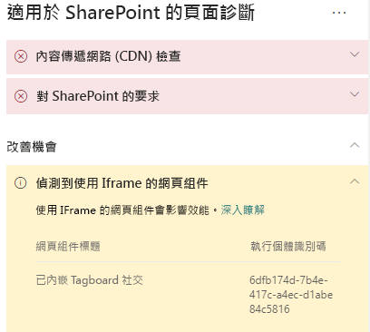
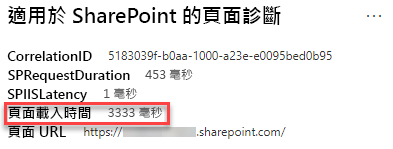

# 在 SharePoint Online 新式與傳統發佈網站頁面中最佳化 iFrame

iFrame 對於預覽多種格式的內容 (例如影面或其他媒體) 而言相當有用。 不過，因為 iFrame 會在 SharePoint 網站頁面內載入個別頁面，所以在 iFrame 中載入的內容可能包含大量影像、影片或其他元素，以上項目都會影響整體頁面載入時間，而且您無法在頁面上進行控制。 本文可協助您了解如何判斷頁面中的 iFrame 如何影響使用者察覺延遲，以及如何修復常見問題。

>[!NOTE]
>如需有關 SharePoint Online 新式網站效能的詳細資訊，請參閱 [SharePoint 新式體驗中的效能](https://docs.microsoft.com/zh-TW/sharepoint/modern-experience-performance)。

## 使用「適用於 SharePoint 的頁面診斷」工具，透過 iFrame 來分析網頁組件

**適用於 SharePoint 的頁面診斷工具**是 Chrome 和 [Microsoft Edge 77 版或更新版本](https://www.microsoftedgeinsider.com/en-us/download?form=MI13E8&OCID=MI13E8)的瀏覽器擴充功能，您可以用來分析 SharePoint 新式與傳統發佈網站頁面。 該工具會針對每個分析頁面提供一份報告，顯示頁面如何針對定義的效能準則組執行。 若要安裝及了解「適用於 SharePoint 的頁面診斷」工具，請造訪[使用適用於 SharePoint Online 的頁面診斷工具](page-diagnostics-for-spo.md)。

當您使用「適用於 SharePoint 的頁面診斷」工具分析 SharePoint 網站頁面時，您可以在 [診斷測試]__ 窗格中看到包含 iFrame 的網頁組件相關資訊。 新式頁面與傳統頁面的基準計量是相同的。

可能的結果包括：

- **需要注意** (紅色)：頁面包含**三個以上**使用 iFrame 的網頁組件
- **改善機會** (黃色)：頁面包含**一個或兩個**使用 iFrame 的網頁組件
- **不需要任何動作** (綠色)：頁面不包含任何使用 iFrame 的網頁組件

如果 [偵測到使用 iFrame 的網頁組件]**** 結果顯示在 [改善機會]**** 或 [需要注意]**** 區段中，您可以按一下結果以查看包含 iFrame 的網頁組件。

## 修復 iFrame 效能問題

使用 [頁面診斷] 工具中的 [偵測到使用 iFrame 的網頁組件]**** 結果，以判斷哪些網頁組件包含 iFrame，且可能造成頁面載入時間變慢。

iFrame 原本就相當緩慢，因為它們會載入個別外部頁面，包括所有相關聯內容，例如 javascript、CSS 及架構元素，其中兩個以上的元素可能會增加網站頁面的負載。

請依照以下指導方針，以確保您能最佳地使用 iFrame。

- 如果預覽是可開始的小型影像或者非互動式，盡可能使用影像而不是使用 iFrame。
- 如果必須使用 iFrame，將數量降至最低及/或將它們移出檢視區。
- 內嵌 Office 檔案 (例如 Word、Excel 和 PowerPoint) 是互動式的，但是載入速度緩慢。 具有完整文件連結的影像縮圖，通常有更好的效果。
- 內嵌 YouTube 影片和 Twitter 摘要在 iFrame 中能夠執行地更好，但是請謹慎地使用這些類型的內嵌。
- 隔離的網頁組件是合理的例外，但是請將它們的數量降至最低並且避免放在檢視區中。
- 如果 iFrame 位於檢視區外，請考量使用 _IntersectionObserver_ 以延遲轉譯 iFrame，直到它出現在檢視中。

在您進行頁面修訂以修復效能問題之前，請記下分析結果中的頁面載入時間。 在修訂後再次執行工具，以查看新結果是否在基準標準內，並檢查新頁面的載入時間，以查看是否有改善。

>[!NOTE]
>頁面載入時間會根據各種因素而有所不同，例如網路負載、一天的時間及其他暫時條件。 您應該在進行變更前後測試幾次頁面載入時間，以協助您計算結果的平均值。

## 相關主題

[調整 SharePoint Online 效能](tune-sharepoint-online-performance.md)

[調整 Office 365 效能](tune-office-365-performance.md)

[SharePoint 新式體驗中的效能](https://docs.microsoft.com/zh-TW/sharepoint/modern-experience-performance.md)
