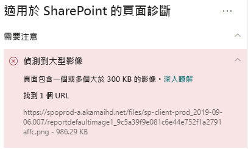

# 在 SharePoint Online 新式網站頁面中最佳化影像Optimize images in SharePoint Online modern site pages

本文可協助您了解如何在 SharePoint Online 新式網站頁面中最佳化影像。This article will help you understand how to optimize images in SharePoint Online modern site pages.

如需最佳化傳統發布網站中的影像的詳細資訊，請參閱[ SharePoint Online 的影像最佳化](image-optimization-for-sharepoint-online.md)For information about optimizing images in classic publishing sites, see [Image optimization for SharePoint Online](image-optimization-for-sharepoint-online.md)..

>[!NOTE]
>如需有關 SharePoint Online 新式入口網站效能的詳細資訊，請參閱 [SharePoint 新式體驗中的效能](https://docs.microsoft.com/sharepoint/modern-experience-performance)。For more information about performance in SharePoint Online modern portals, see [Performance in the modern SharePoint experience](https://docs.microsoft.com/sharepoint/modern-experience-performance).

## 使用「適用於 SharePoint 的頁面診斷」工具來分析影像最佳化Use the Page Diagnostics for SharePoint tool to analyze image optimization

**適用於 SharePoint 的頁面診斷工具**是 Chrome 和 [Microsoft Edge 77 版或更新版本](https://www.microsoftedgeinsider.com/download?form=MI13E8&OCID=MI13E8)的瀏覽器擴充功能，您可以用來分析 SharePoint 新式與傳統發布網站頁面。The **Page Diagnostics for SharePoint tool** is a browser extension for Chrome and [Microsoft Edge version 77 or later](https://www.microsoftedgeinsider.com/download?form=MI13E8&OCID=MI13E8) you can use to analyze SharePoint both modern and classic publishing site pages. 該工具會針對每個分析頁面提供一份報告，顯示頁面如何針對定義的效能準則組執行。The tool provides a report for each analyzed page showing how the page performs against a defined set of performance criteria. 若要安裝及了解「適用於 SharePoint 的頁面診斷」工具，請造訪[使用 SharePoint Online 頁面診斷工具](page-diagnostics-for-spo.md)To install and learn about the Page Diagnostics for SharePoint tool, visit [Use the Page Diagnostics tool for SharePoint Online](page-diagnostics-for-spo.md).

當您使用「適用於 SharePoint 的頁面診斷」工具分析 SharePoint 新式網站時，您可以在 [診斷測試]__ 窗格中看到大型影像的資訊。When you analyze a SharePoint modern site with the Page Diagnostics for SharePoint tool, you can see information about large images in the _Diagnostic tests_ pane.

可能的結果包括：Possible results include:

- **需要注意** (紅色)：頁面包含 [一或多個]\*\*\*\* 大小超過 300KB 的影像**Attention required** (red): The page contains **one or more** images over 300KB in size
- **不需要採取動作** (紅色)：頁面未包含大小超過 300KB 的影像**No action required** (green): The page contains no images over 300KB in size

如果大型影像的偵測結果顯示在結果的 [需要注意] 區段，您可以按一下結果來查看其他詳細資料。If the **Large images detected** result appears in the **Attention required** section of the results, you can click the result to see additional details.

## 修正大型影像問題Remediate large image issues

如果頁面的影像大小超過 300KB，請選取 [偵測到大型影像]\*\*\*\* 結果，以查看哪些影像太大。If a page contains images over 300KB in size, select the **Large images detected** result to see which images are too large. 在新式 SharePoint Online 頁面中，系統會自動提供影像的轉譯，並根據瀏覽器視窗的大小和用戶端監視器的解析度來調整影像大小。In modern SharePoint Online pages, renditions of images are automatically provided and sized depending on the size of the browser window and the resolution of the client monitor. 在上傳至 SharePoint Online 之前，您應隨時最佳化網頁使用的影像。You should always optimize images for web use prior to upload to SharePoint Online. 系統會自動縮小過大的影像和解析度，這可能會導致非預期的轉譯特性。Very large images will be automatically reduced in size and resolution which can result in unexpected rendering characteristics.

在您進行頁面修訂以修復效能問題之前，請記下分析結果中的頁面載入時間。Before you make page revisions to remediate performance issues, make a note of the page load time in the analysis results. 在修訂後再次執行工具，以查看新結果是否在基準標準內，並檢查新頁面的載入時間，以查看是否有改善。Run the tool again after your revision to see if the new result is within the baseline standard, and check the new page load time to see if there was an improvement.

>[!NOTE]
>頁面載入時間會因為各種因素而有所不同，例如網路負載、一天的時間及其他暫時條件。Page load time can vary based on a variety of factors such as network load, time of day, and other transient conditions. 您應該在進行變更前後測試幾次頁面載入時間，以協助您計算結果的平均值。You should test page load time a few times before and after making changes to help you average the results.

## 相關主題Related topics

[調整 SharePoint Online 效能Tune SharePoint Online performance](tune-sharepoint-online-performance.md)

[調整 Office 365 效能Tune Office 365 performance](tune-office-365-performance.md)

[SharePoint 新式體驗中的效能Performance in the modern SharePoint experience](https://docs.microsoft.com/sharepoint/modern-experience-performance.md)

[內容傳遞網路Content delivery networks](content-delivery-networks.md)

[使用 Office 365 內容傳遞網路 (CDN) 搭配 SharePoint OnlineUse the Office 365 Content Delivery Network (CDN) with SharePoint Online](use-office-365-cdn-with-spo.md)
