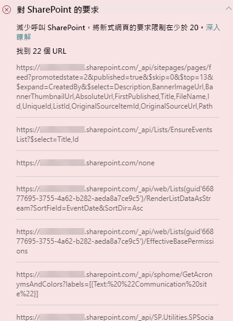

# 在 SharePoint Online 新式與傳統發佈網站頁面中最佳化頁面呼叫

SharePoint Online 新式與傳統發佈網站都包含連結，會從 SharePoint 功能和 CDN 載入資料 (或進行呼叫)。 頁面進行的呼叫越多，頁面載入所花費的時間越久。 這稱為**使用者察覺延遲**或 **EUPL**。

本文可協助您了解如何從您的新式和傳統發佈網站頁面中判斷對外部端點呼叫的數量及影響，以及如何限制其對使用者察覺延遲的影響。

>[!NOTE]
>如需有關 SharePoint Online 新式入口網站效能的詳細資訊，請參閱 [SharePoint 新式體驗中的效能](https://docs.microsoft.com/sharepoint/modern-experience-performance)。

## 使用「適用於 SharePoint 的頁面診斷」工具來分析頁面呼叫

**適用於 SharePoint 的頁面診斷工具**是 Chrome 和 [Microsoft Edge 77 版或更新版本](https://www.microsoftedgeinsider.com/download?form=MI13E8&OCID=MI13E8)的瀏覽器擴充功能，您可以用來分析 SharePoint 新式與傳統發佈網站頁面。 該工具會針對每個分析頁面提供一份報告，顯示頁面如何針對定義的效能準則組執行。 若要安裝及了解「適用於 SharePoint 的頁面診斷」工具，請造訪[使用適用於 SharePoint Online 的頁面診斷工具](page-diagnostics-for-spo.md)。

當您使用「適用於 SharePoint 的頁面診斷」工具分析 SharePoint 網站頁面時，您可以在 [診斷測試]__ 窗格的 [對 SharePoint 的要求]**** 結果中看到關於外部呼叫的資訊。 如果網站頁面包含的呼叫數目少於呼叫的基準數，則此行會顯示為綠色，如果頁面超過基準數，則會顯示為紅色。 因為傳統網站頁面使用 HTTP1.1，而新式頁面使用 HTTP2.0，所以新式頁面與傳統頁面的基準數不同：

- 新式網站頁面應最多包含 **25** 個呼叫
- 傳統發佈頁面應最多包含 **6** 個呼叫

可能的結果包括：

- **需要注意** (紅色)：頁面超過呼叫的基準數
- **不需要任何動作** (綠色)：頁面包含的呼叫數少於基準數

如果 [對 SharePoint 的要求]**** 顯示在 [需要注意]**** 區段中，您可以按一下結果以取得詳細資訊，包括頁面上呼叫的總數與 URL 的清單。

## 修復與頁面上呼叫過多相關的效能問題

如果頁面包含太多呼叫，您可以使用 [對 Sharepoint 的要求]**** 結果中的 URL 清單，以判斷是否有任何重複的呼叫、應該批次進行的呼叫，或傳回應快取資料的要呼叫。

**批次處理 REST 呼叫**可協助降低效能負荷。 如需有關 API 呼叫批次處理的詳細資訊，請參閱[使用 REST API 建立批次要求](https://docs.microsoft.com/sharepoint/dev/sp-add-ins/make-batch-requests-with-the-rest-apis) (英文)。

**使用快取**以儲存 API 呼叫的結果，可讓用戶端使用快取的資料，而不是為每個後續頁面載入進行額外呼叫，藉以改善處理暖要求的效能。 依據商務需求而定，有多種方法可以達成這個解決方案。 通常，如果所有使用者的資料都是相同的，使用像是 [_Azure Redis_ 快取](https://azure.microsoft.com/services/cache/) 的中介層快取服務是極佳的選項，可以大幅降低網站的 API 流量，因為使用者是從快取服務要求資料，而不是直接從 SPO 要求資料。 只有在您重新整理中介層的快取時，才需要進行 SPO 呼叫。 如果資料會因為個別使用者而波動，最好的做法可能是實作用戶端快取，例如 LocalStorage 或甚至是 Cookie。 這要仍然可以藉由排除相同使用者在快取期間內所進行的後續要求，來降低呼叫量，但是這樣的效率比專用快取服務差。 PnP 可讓您使用 LocalStorage，只需要一些額外的開發。

在您進行頁面修訂以修復效能問題之前，請記下分析結果中的頁面載入時間。 在修訂後再次執行工具，以查看新結果是否在基準標準內，並檢查新頁面的載入時間，以查看是否有改善。

>[!NOTE]
>頁面載入時間會因為各種因素而有所不同，例如網路負載、一天的時間及其他暫時條件。 您應該在進行變更前後測試幾次頁面載入時間，以協助您計算結果的平均值。

## 相關主題

[調整 SharePoint Online 效能](tune-sharepoint-online-performance.md)

[調整 Office 365 效能](tune-office-365-performance.md)

[SharePoint 新式體驗中的效能](https://docs.microsoft.com/sharepoint/modern-experience-performance)

[內容傳遞網路](content-delivery-networks.md)

[使用 Office 365 內容傳遞網路 (CDN) 搭配 SharePoint Online](use-office-365-cdn-with-spo.md)
