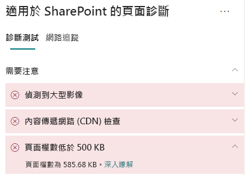

# 在 SharePoint Online 新式網站頁面中最佳化頁面權數Optimize page weight in SharePoint Online modern site pages

SharePoint Online 新式網站頁面包含轉譯頁面的頁面內容所需的序列化代碼，頁面內容包括瀏覽/命令列底下內容區域中的影像、文字、物件，以及形成頁面架構的其他 HTML 程式碼。SharePoint Online modern site pages contain serialized code that is required to render page content of the page, including images, text, objects in the content area underneath navigation/command bars and other HTML code that forms the framework of the page. 頁面權數是這個 HTML 程式碼的度量，應加以限制，以確保最佳的頁面載入時間。Page weight is a measurement of this HTML code, and should be limited to ensure optimal page load times.

本文可協助您了解如何在新式網站頁面中減少頁面權數。This article will help you understand how to reduce page weight in your modern site pages.

>[!NOTE]
>如需有關 SharePoint Online 新式入口網站效能的詳細資訊，請參閱 [SharePoint 新式體驗中的效能](https://docs.microsoft.com/sharepoint/modern-experience-performance)。For more information about performance in SharePoint Online modern portals, see [Performance in the modern SharePoint experience](https://docs.microsoft.com/sharepoint/modern-experience-performance).

## 使用「適用於 SharePoint 的頁面診斷」工具來分析頁面權數Use the Page Diagnostics for SharePoint tool to analyze page weight

適用於 SharePoint 的頁面診斷工具是全新 Microsoft Edge (https://www.microsoft.com/edge) 和 Chrome 瀏覽器的擴充功能，可以用來分析 SharePoint Online 新式入口網站與傳統發佈網站頁面。The Page Diagnostics for SharePoint tool is a browser extension for the new Microsoft Edge (https://www.microsoft.com/edge) and Chrome browsers that analyzes both SharePoint Online modern portal and classic publishing site pages. 該工具會針對每個分析頁面提供一份報告，顯示頁面如何針對定義的效能準則組執行。The tool provides a report for each analyzed page showing how the page performs against a defined set of performance criteria. 若要安裝及了解「適用於 SharePoint 的頁面診斷」工具，請造訪[使用適用於 SharePoint Online 的頁面診斷工具](page-diagnostics-for-spo.md)。To install and learn about the Page Diagnostics for SharePoint tool, visit [Use the Page Diagnostics tool for SharePoint Online](page-diagnostics-for-spo.md).

>[!NOTE]
>網頁診斷工具只能用於 SharePoint Online，且無法在 SharePoint 系統頁面使用。The Page Diagnostics tool only works for SharePoint Online, and cannot be used on a SharePoint system page.

當您使用「適用於 SharePoint 的頁面診斷」工具分析 SharePoint 網站頁面時，您可以在 [診斷測試]__ 窗格的 [頁面權數低於 500KB]\*\*\*\* 結果中看到關於頁面的資訊。When you analyze a SharePoint site page with the Page Diagnostics for SharePoint tool, you can see information about page in the **Page weight under 500KB** result of the _Diagnostic tests_ pane. 如果頁面權數低於基準值，則結果會顯示為綠色，如果頁面權數超過基準值，則會顯示為紅色。The result will appear in green if the page weight is under the baseline value, and red if the page weight exceeds the baseline value.

可能的結果包括：Possible results include:

- **需要注意** (紅色)：頁面權數超過 500KB**Attention required** (red): Page weight exceeds 500KB
- **不需要任何動作** (綠色)：頁面權數低於 500KB**No action required** (green): Page weight is under 500KB

如果 [頁面權數低於 500KB]\*\*\*\* 結果顯示在 [需要注意]\*\*\*\* 區段中，您可以按一下結果以取得詳細資訊。If the **Page weight under 500KB** result appears in the **Attention required** section, you can click the result for details.

## 修復頁面權數問題Remediate page weight issues

如果頁面權數超過 500KB，您可以藉由減少網頁組件的數量，並將頁面內容限制在適當的程度，以改善整體頁面載入時間。If page weight exceeds 500KB, you can improve overall page load time by reducing the number of web parts and limiting page content to an appropriate degree.

降低頁面權數的一般指導方針包括：General guidance for reducing page weight includes:

- 將頁面內容限制為合理的數量，並且對相關內容使用多個頁面。Limit the page content to a reasonable amount and use multiple pages for related content.
- 將具有大型屬性包的網頁組件使用降至最低。Minimize the use of web parts that have large property bags.
- 盡可能使用非互動式彙總檢視。Use non-interactive rollup views when possible.
- 您可以使用壓縮的影像格式並確保是從 CDN 下載，以適當地調整影像大小。Optimize image sizes by sizing images appropriately, using compressed image formats and ensuring that they are downloaded from a CDN.

您可以在下列文章中找到更多關於限制頁面權數的指導方針：You can find additional guidance for limiting page weight in the following article:

- [在 SharePoint 中最佳化頁面效能](https://docs.microsoft.com/sharepoint/dev/general-development/optimize-page-performance-in-sharepoint) (英文)[Optimize page performance in SharePoint](https://docs.microsoft.com/sharepoint/dev/general-development/optimize-page-performance-in-sharepoint)

在您進行頁面修訂以修復效能問題之前，請記下分析結果中的頁面載入時間。Before you make page revisions to remediate performance issues, make a note of the page load time in the analysis results. 在修訂後再次執行工具，以查看新結果是否在基準標準內，並檢查新頁面的載入時間，以查看是否有改善。Run the tool again after your revision to see if the new result is within the baseline standard, and check the new page load time to see if there was an improvement.

>[!NOTE]
>頁面載入時間會因為各種因素而有所不同，例如網路負載、一天的時間及其他暫時條件。Page load time can vary based on a variety of factors such as network load, time of day, and other transient conditions. 您應該在進行變更前後測試幾次頁面載入時間，以協助您計算結果的平均值。You should test page load time a few times before and after making changes to help you average the results.

## 相關主題Related topics

[調整 SharePoint Online 效能Tune SharePoint Online performance](tune-sharepoint-online-performance.md)

[調整 Office 365 效能Tune Office 365 performance](tune-office-365-performance.md)

[SharePoint 新式體驗中的效能Performance in the modern SharePoint experience](https://docs.microsoft.com/sharepoint/modern-experience-performance)

[內容傳遞網路Content delivery networks](content-delivery-networks.md)

[使用 Office 365 內容傳遞網路 (CDN) 搭配 SharePoint OnlineUse the Office 365 Content Delivery Network (CDN) with SharePoint Online](use-office-365-cdn-with-spo.md)
