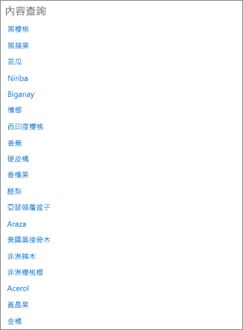

# 使用，而不內容查詢網頁組件的內容搜尋網頁組件來增進效能的 SharePoint OnlineUsing Content Search Web Part instead of Content Query Web Part to improve performance in SharePoint Online

本文說明如何在 SharePoint Server 2013 和 SharePoint Online 內容搜尋網頁組件以取代 「 內容查詢網頁組件以提升效能。This article describes how to increase performance by replacing the Content Query Web Part with the Content Search Web Part in SharePoint Server 2013 and SharePoint Online.
  
其中一個最強大的新功能的 SharePoint Server 2013 和 SharePoint Online 是內容搜尋網頁組件 (CSWP)。此網頁組件會使用搜尋索引快速地擷取會向使用者顯示的結果。用於內容搜尋網頁組件，而不是內容查詢網頁組件 (CQWP) 頁面中的使用者提升效能。One of the most powerful new features of SharePoint Server 2013 and SharePoint Online is the Content Search Web Part (CSWP). This Web Part uses the search index to quickly retrieve results which are shown to the user. Use the Content Search Web Part instead of the Content Query Web Part (CQWP) in your pages to improve performance for your users.
  
透過 「 內容查詢網頁組件中使用 「 內容搜尋網頁組件幾乎一定會產生大幅改善 SharePoint Online 上的頁面負載效能。有一點的其他設定即可使用取得正確的查詢，但獎賞改善的效能而且滿足使用者。Using a Content Search Web Part over a Content Query Web Part will almost always result in significantly better page load performance on SharePoint Online. There is a little additional configuration to get the right query, but the rewards are improved performance and happier users.
  
## 比較您取得無法使用內容搜尋網頁組件而不內容查詢網頁組件的效能提升Comparing the performance gain you get from using Content Search Web Part instead of Content Query Web Part

下列範例顯示當您使用 「 內容搜尋網頁組件而不是 「 內容查詢網頁組件可能會收到相對的效能提升。效果會更明顯與複雜的網站結構和非常廣泛的內容查詢。The following examples show the relative performance gains you may receive when you use a Content Search Web Part instead of a Content Query Web Part. The effects are more obvious with a complex site structure and very broad content queries.
  
此範例網站都具有下列特性：This example site has the following characteristics:
  
- 8 的層級的子網站。8 levels of subsites.
    
- 列出使用自訂"水果 」 內容類型。Lists using a custom "fruit" content type.
    
- 在 [網頁組件中的內容查詢是廣泛，傳回所有的項目與"水果 」 內容類型。In the Web Part, the content query is broad, returning all items with the content type of "fruit".
    
- 範例只會使用 8 網站之間的 50 項目。效果會為更為明顯的網站具有多個內容之用。The example only uses 50 items across the 8 sites. The effects will be even more pronounced for sites with more content.
    
以下是內容查詢網頁組件的結果的螢幕擷取畫面。Here is a screen shot of the results of the Content Query Web Part.
  

  
在 Internet Explorer 中，使用 F12 開發人員工具的 [**網路**] 索引標籤來查看回應標頭的詳細資料。下列螢幕擷取畫面中，載入此頁面**SPRequestDuration**的值會是 924 （毫秒）。In Internet Explorer, use the **Network** tab of the F12 developer tools to look at the details for the response header. In the following screen shot, the value for the **SPRequestDuration** for this page load is 924 milliseconds. 
  

  
 **SPRequestDuration**表示要準備] 頁面上的伺服器上的已完成的工作數量。切換內容搜尋網頁組件的內容查詢網頁組件可大幅減少轉譯頁面所花費的時間。相較之下，對等的內容搜尋網頁組件] 頁面上，傳回相同的結果數具有 106 （毫秒） 此螢幕擷取畫面所示的**SPRequestDuration**值：**SPRequestDuration** indicates the amount of work that is done on the server to prepare the page. Switching Content by Query Web Parts with Content by Search Web Parts dramatically reduces the time it takes to render the page. By contrast, a page with an equivalent Content Search Web Part, returning the same number of results has an **SPRequestDuration** value of 106 milliseconds as shown in this screen shot: 
  

  
## 新增內容搜尋網頁組件在 SharePoint OnlineAdding a Content Search Web Part in SharePoint Online

新增內容搜尋網頁組件是非常類似於在規則的內容查詢網頁組件。請參閱] 區段中[設定內容搜尋網頁組件在 SharePoint 中](https://support.office.com/article/Configure-a-Content-Search-Web-Part-in-SharePoint-0dc16de1-dbe4-462b-babb-bf8338c36c9a)的 *「 新增內容搜尋網頁組件 」* 。Adding a Content Search Web Part is very similar to a regular Content Query Web Part. See the section  *"Add a Content Search Web Part"*  in [Configure a Content Search Web Part in SharePoint](https://support.office.com/article/Configure-a-Content-Search-Web-Part-in-SharePoint-0dc16de1-dbe4-462b-babb-bf8338c36c9a).
  
## 建立正確的搜尋查詢的內容搜尋網頁組件Creating the right search query for your Content Search Web Part

一旦您已經新增內容搜尋網頁組件，您可精簡搜尋及傳回您想要的項目。如需如何執行這項作業的詳細指示，請參閱] 區段中，[設定內容搜尋網頁組件在 SharePoint](https://support.office.com/article/Configure-a-Content-Search-Web-Part-in-SharePoint-0dc16de1-dbe4-462b-babb-bf8338c36c9a)中的 *「 設定內容搜尋網頁組件的進階的查詢顯示內容 」* 。Once you have added a Content Search Web Part, you can refine the search and return the items you want. For detailed instructions on how to do this, see the section,  *"Display content by configuring an advanced query in a Content Search Web Part"*  in [Configure a Content Search Web Part in SharePoint](https://support.office.com/article/Configure-a-Content-Search-Web-Part-in-SharePoint-0dc16de1-dbe4-462b-babb-bf8338c36c9a).
  
## 查詢建立及測試工具Query building and testing tool

建立及測試複雜查詢工具，請參閱 Codeplex 上的[搜尋查詢工具](https://sp2013searchtool.codeplex.com/)。For a tool to build and test complex queries, see the [Search Query Tool](https://sp2013searchtool.codeplex.com/) on Codeplex. 
  

